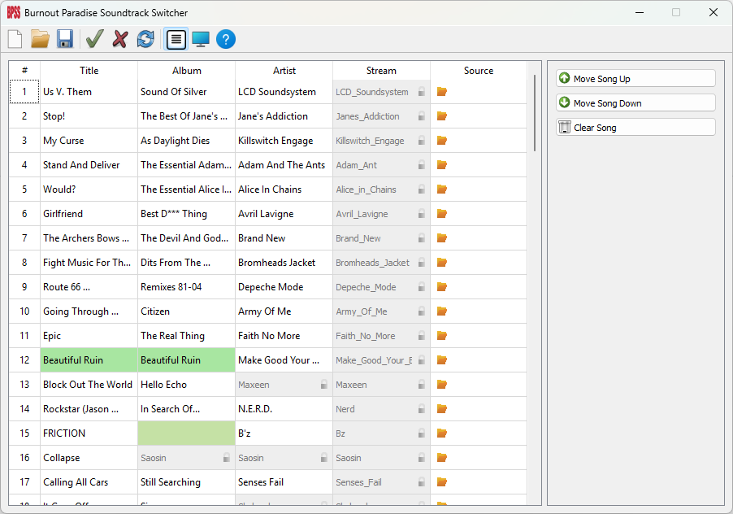

# BPSS
Burnout Paradise Song Switcher. Easy-to-use GUI for modifying song data and audio for Burnout Paradise. Works for both Remastered and The Ultimate Box.

Requires [sx](https://burnout.wiki/wiki/Sounds_(Burnout_Paradise)) and [YAP](https://github.com/burninrubber0/YAP).

## How to Setup
Just point BPSS at your install folder for Burnout Paradise, your sx.exe file, and your YAP.exe file.

## How to Use
Make your desired soundtrack changes in the table, then press Apply to apply those changes to your game. Press Unapply to revert all changes, and Reset to reset the table back to defaults, or to your currently loaded file.

To apply your changes, they need to be saved to a file.